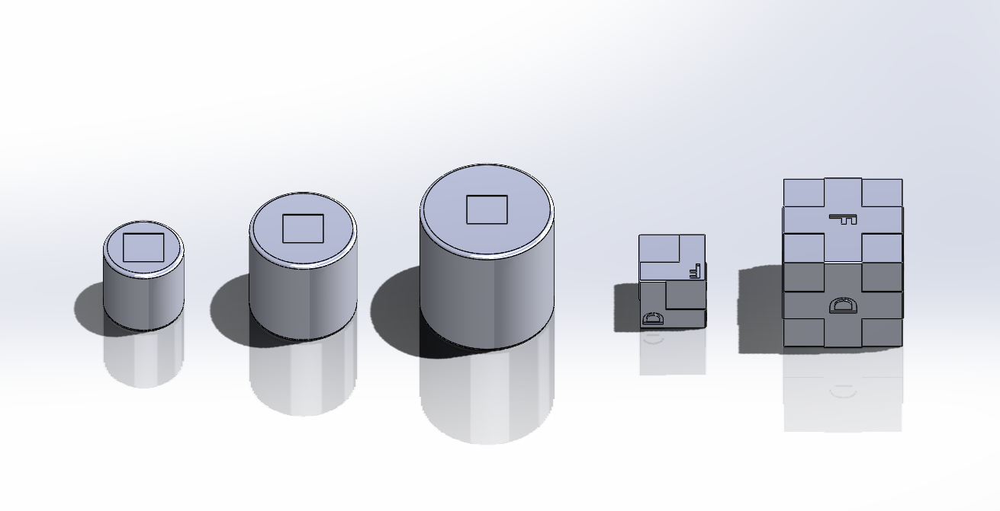
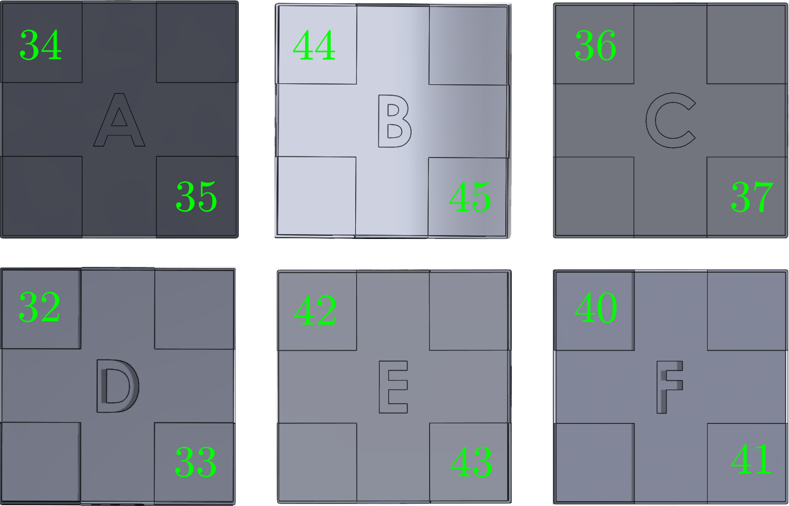

# RGMC In-Hand Manipulation 2024
> :warning: **This repository has two branches. The `main` branch is intended to be used by teams to test their systems during the development. The `real-eval` branch will be used by the teams and judges during the competition in ICRA 2024.**

> :warning: **This README is mainly a description of the `main` branch, except for the section "real-eval" that describes the package usage during the competition.**


This ROS package provides the auto-evalutor for the in-hand manipulation competition in the 9th Robotic Grasping and Manipulation Competition (RGMC)
during IEEE-RAS International Conference on Robotics and Automation (ICRA) at Yokohama, Japan, May 13-17, 2024.

This auto-evaluator can help the participating teams to develop their solutions for the competition. During the competition, all teams will be scored and ranked using this auto-evaluator as well.

\* The competition details including scroing and ranking protocols can be found at: https://hangkaiyu.github.io/RGMC_in_hand_manipulation_subtrack.html

## Getting started

### System Requirements
This ROS package has been developed and tested with:
- Ubuntu 20.04
- [ROS Noetic](http://wiki.ros.org/noetic/Installation/Ubuntu)

We will test with more Ubuntu and ROS distributions, but we expect this package to be fully compatible with all existing ROS versions.

### Object Tracking
Along with other common ROS packages, this auto-evaluator package relies on [apriltag_ros](https://wiki.ros.org/apriltag_ros) to track the objects being manipulated. apriltag_ros should be installed in the same catkin workspace where this auto-evaluator package is.

### Installation
We assume you already have a catkin workspace, where your other ROS packages are located. To get this ROS package into your system:
```
    cd ~/catkin_ws/src 
    git clone --recursive git@github.com:Rice-RobotPI-Lab/RGMC_In-Hand_Manipulation_2024.git
```
Next, to install relevant Python dependencies:
```
    bash ./install
```


## Usage

### Camera calibration file
For the apriltag_ros package to work correctly with this auto-evaluator package, the camera info file (camera intrisic calibration file) should be located at and named as `RGMC_In-Hand_Manipulation_2024/config/camera_info/usb_cam_1080p.yaml` with the same format as the provided example.

### Objects and Apriltags


There are 5 3D printed objects with their models in `RGMC_In-Hand_Manipulation_2024/models`, plus one unknown object for task A, as shown in the figure above. The cylinders are 60mm, 80mm, 100mm in diameters and 100mm tall.  The cubes are of sizes 50\*50\*50 mm<sup>3</sup> and 90\*90\*90 mm<sup>3</sup>. On the cynlinder objects, there is a 30\*30\*1 mm3 reserved space to attach the apriltags. On the small and large cube objects, there are one or four of such reserved spaces on each facet. We use tag family <b>tag36h11</b> from apriltag_ros to track the pose of the manipulated objects. 


For Task A, the tag used to track the cylinders is specified in `RGMC_In-Hand_Manipulation_2024/config/tags_taskA.yaml`.

For Task B, the tags used to track the facets of the cubes are specified in `RGMC_In-Hand_Manipulation_2024/config/tags_taskB.yaml`, and the mapping between tags and the facets are listed in `RGMC_In-Hand_Manipulation_2024/config/tags_cube.yaml`. If your team choose to use the large cube, you can attach 2 apriltags diagonally on each facet to enhance the tracking stability. The tag ids and their attachement locations are shown in the figure below. If you choose to use the small cube, you can only attach one apriltag on each facet (any one of the two specified in `RGMC_In-Hand_Manipulation_2024/config/tags_cube.yaml`).




> :warning: **Do not modify the tag files under `RGMC_In-Hand_Manipulation_2024/config/`. We will use exactly those tag ids and sizes to evaluate your team's performance during the competition.**


### Task A: Object Position Control for Waypointss Tracking
To start the task A run
```
    roslaunch RGMC_In-Hand_Manipulation_2024 taskA.launch
```
Once the operator has initialized the grasp and approved the selected object's initial position, call the ROS service `/rgcm_eval/start` to start the auto-evaluator and set the initial object position. 
The current goal waypoint, relative to the initial position, will be broadcasted to the topic `/rgcm_eval/taskA/goal` at 0.1-second intervals. 
Once you are done with a goal waypoint, the performance with respect to the current goal waypoint is evaluated by calling the ROS service `/rgcm_eval/record`, which will also trigger the auto-evaluator to publish the next goal waypoint.
Otherwise, if the time limit of 20 seconds per goal waypoint is reached, the auto-evaluator will automatically record the result and move to the next waypoint.
The auto-evaluator will accumulate the error of every goal waypoint into the overall distance error.

The waypoints are all limited within the range of <b>\[-2.5cm, 2.5cm\] \* \[-2.5cm, 2.5cm\] \* \[-2.5cm, 2.5cm\]</b> centered at the intial position of the grasped object. An example list of waypoints is provided in `RGMC_In-Hand_Manipulation_2024/task/taskA.yaml`. The goal waypoints can be alternatively specified by different files in `RGMC_In-Hand_Manipulation_2024/task` by setting the roslaunch argument, for example:
```
    roslaunch RGMC_In-Hand_Manipulation_2024 taskA.launch task_name:=taskA.yaml
```

### Task B: Object Re-orientation
To start the task B run
```
    roslaunch RGMC_In-Hand_Manipulation_2024 taskB.launch
```
Once the operator has initialized and stabilized the grasp, call the ROS service `/rgcm_eval/start` to start the task. The current goal facet is broadcasted to the topic `/rgcm_eval/taskB/goal` at 0.1-second intervals. Once you are done with a goal facet, the performance with respect to the current goal facet is evaluated by calling the ROS service `/rgcm_eval/record`, which will also trigger the auto-evaluator to publish the next goal facet. Otherwise, if the time limit of 30 seconds is reached, the auto-evaluator will automatically record the result and move to the next target facet. If the orientation of the cube's goal facet is within 0.5 rad facing the camera, it will count as a success. The total number of successfully reached goal facets will be recorded. The list of goal facets is specified by a file in `RGMC_In-Hand_Manipulation_2024/task` by setting the roslaunch argument, for example:
```
    roslaunch RGMC_In-Hand_Manipulation_2024 taskB.launch task_name:=taskB.yaml
```


> :warning: **For both Task A and Task B, please pay attention to the stdout printed by the auto-evaluator to see what metrics are evaluated.**

### real-eval
`real-eval` is a branch under this repository that will be used by the judges and teams during the competition. At the competition, the judges will bring their own computers to run the evaluator, and the teams will run all their code on their own computers that are on the **same ROS network** with the judges computers.

**Network configuration:** Every team will provide 1 computer dedicated as the ROS Master where the roscore is running. Other programs can also run on this ROS Master computer as needed. The judge computers will **NOT** provide a roscore. We will use the IP range `192.168.100.0/24`. The ROS Master's IP address has to be manually configured to `192.168.0.100`. The judges computer will use the IP address `192.168.0.101`. Each team can use mulitple other computers as needed with other unreserved IPs. 

We will bring network switches to the competition to facilitate the network setup. <b>The teams need to make sure your computers have Ethernet ports and please bring Ehthernet cables for your own computers to be connected with our switches</b>.

**Judges:** The judges will launch the task evaluator by running the commands described above. For example:  
```
    roslaunch RGMC_In-Hand_Manipulation_2024 taskA.launch
```
or
```
    roslaunch RGMC_In-Hand_Manipulation_2024 taskB.launch
```
These commands, differently from the `main` branch, will *NOT* launch the camera and the apriltag_ros. On the judges' computers, only the auto-evaluator will be launched. The auto-evaluator will read the Apriltag's poses from the ROS topics, which should be published from the team's computers.

**Teams**: Every team is responsible of making sure that the network is correctly configured, and that the camera + Apriltag are running to publish the tag's poses. We highly recommend every team to carefully read the launch files `taskA.launch` and `taskB.launch` and understand the differences between the two branches. In particular, we recommend the teams to include `single_camera_track.launch` in their own launch files when `real-eval` branch is used at the competition.


### Publishers
Topic | Type | Description
------|------|-------------
`/rgcm_eval/taskA/goal`| [geometry_msgs/Point](http://docs.ros.org/en/noetic/api/geometry_msgs/html/msg/Point.html) | Current goal position for Task A.
`/rgcm_eval/taskB/goal`| [std_msgs/String](http://docs.ros.org/en/melodic/api/std_msgs/html/msg/String.html)| Current targeted cube facet marked by "A, B, C, D, E, F" for task B.

### Services
Topic | Type | Description
------|------|-------------
`/rgcm_eval/start`|[std_srvs/Trigger](http://docs.ros.org/en/melodic/api/std_srvs/html/srv/Trigger.html)| Start the task and the timer. For task A, also set initial position for trajectory tracing.
`/rgcm_eval/record`|[std_srvs/Trigger](http://docs.ros.org/en/melodic/api/std_srvs/html/srv/Trigger.html)| Record the position/orientation for scoring for the current waypoint and move on to the next one.
`/rgcm_eval/stop`|[std_srvs/Trigger](http://docs.ros.org/en/melodic/api/std_srvs/html/srv/Trigger.html)| Stop the current task
